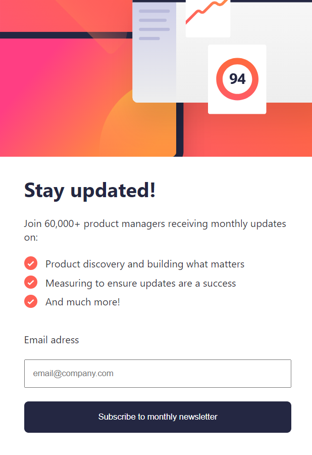

# email signup page (NO FUNCTIONALITY YET JUST DESIGN)

## link will be here soon

## desktop

## mobile

## why i got into this challenge
I got into this challenge to test out my layout skill

## challenges that i encountered
the challenges i got are mostly from the responsive part, i struggled with making the picture change when its on mobile and change it back to its original image when it was on a desktop device. also i struggled to make the button from the success part in mobile be at bottom while being in the center

## how i tackled them
i included an image beside the forms for the desctop and a header that contained the imahe fpr the mobile that filled the sides of the top part. i made the header invisible when it is for desktop and the image invisible for the mobile. and vice versa.  

for the button, i made the position fixed and adjusted the padding of the side of the button untill they felt right 

## final thoughts
i feel proud completing the challenge, i will add the form management soon!

